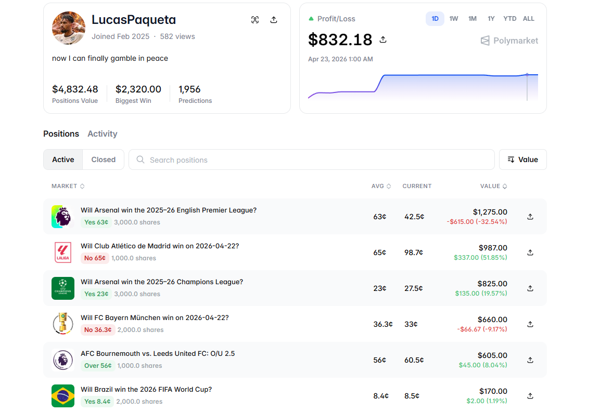

# Polymarket Sports Trading Bot

Node.js / TypeScript trading automation for Polymarket sports markets. The repository is organized as separate packages (tennis, basketball, football), each with an interactive menu to pick matches, background monitoring, and CLOB order execution against league-specific event catalogs.

## Overview

Each package connects to the Polymarket CLOB, refreshes available matches on a schedule, tracks open positions, and applies configurable buy, spread, and take-profit rules. Credentials and state stay local to that package’s `data/` directory.

---



---

https://github.com/user-attachments/assets/69b17c82-e45d-462e-9305-4dac28e857f8

---

https://github.com/user-attachments/assets/a41d90b8-afeb-4858-af82-8a8fdcc50c5e

---

https://github.com/user-attachments/assets/2b41dc6e-b033-4873-bf06-43dfffff81f2

---

### Key features

- **Multi-sport layout**: Isolated `tennis/`, `basketball/`, and `football/` apps with the same core patterns.
- **League menus**: Comma-separated `LEAGUES` in `.env` (per sport) drive which leagues appear in the UI.
- **Position monitor**: Polling and trading rules with configurable buy size, max price, spread, and take-profit delta.
- **CLOB execution**: Orders via Polymarket CLOB with proxy wallet and allowance flows aligned to `Polymarket-Arbitrage-Bot`-style configuration.
- **Persistent state**: `data/` holds credentials, selected markets, positions, and trades (not committed to git).

## Architecture

### Technology stack

- **Runtime**: Node.js, TypeScript
- **Chain**: Polygon (configurable `CHAIN_ID`)
- **Execution**: Polymarket CLOB via `@polymarket/clob-client`
- **Market metadata**: Polymarket APIs (league catalogs and market resolution in each package)
- **Logging**: Structured logger with file output under each package’s `logs/`

### System flow

```
.env + league catalog → Menu / match selection → Monitor polling
→ Price / spread checks → Order placement → data/*.json state update
```

## Installation

### Prerequisites

- Node.js 18+ and npm
- A Polygon wallet with USDC for trading, and a private key available only via environment (never commit it)
- One `.env` per sports package you run (see below)

### Setup

1. **Clone the repository and enter a package directory**

   ```bash
   git clone <repository-url>
   cd Polymarket-Sports-Bot/tennis
   ```

   Use `basketball/` or `football/` instead of `tennis/` when working on those sports.

2. **Install dependencies**

   ```bash
   npm install
   ```

3. **Configure environment**

   ```bash
   cp .env.example .env
   ```

   Edit `.env` for the sport. Example (tennis; defaults shown):

   ```env
   PRIVATE_KEY=your_private_key_here
   PROXY_WALLET_ADDRESS=your_proxy_address
   CLOB_API_URL=https://clob.polymarket.com
   CHAIN_ID=137
   RPC_URL=
   RPC_TOKEN=
   NEG_RISK=true
   TICK_SIZE=0.01
   LEAGUES=atp,wta
   BUY_AMOUNT_USD=10
   MAX_BUY_PRICE=0.85
   MAX_SPREAD=0.1
   TAKE_PROFIT_DELTA=0.15
   MONITOR_POLL_MS=1500
   MATCH_REFRESH_SECONDS=60
   SKIP_LEAGUE_MENU=false
   LOG_LEVEL=info
   ```

   **League examples by package**

   - Tennis: `LEAGUES=atp,wta`
   - Basketball: `LEAGUES=nba,bkcba`
   - Football: `LEAGUES=epl,elc,laliga,ligue-1,bundesliga,ucl`

4. **Credentials**

   On first run the package derives or refreshes API credentials as needed. Local storage is under `<sport>/data/` (see project structure). Do not commit that directory.

## Configuration

### Environment variables

| Variable | Type | Default | Description |
|----------|------|---------|-------------|
| `PRIVATE_KEY` | string | **required** for live trading | Wallet private key |
| `PROXY_WALLET_ADDRESS` | string | `""` | Polymarket proxy / funder address |
| `CLOB_API_URL` | string | `https://clob.polymarket.com` | CLOB base URL |
| `CHAIN_ID` | number | `137` | EVM chain ID (Polygon mainnet) |
| `RPC_URL` | string | optional | Custom RPC; supports token placeholders |
| `RPC_TOKEN` | string | optional | Injected into `RPC_URL` when applicable |
| `NEG_RISK` | boolean | `true` | Neg-risk market handling |
| `TICK_SIZE` | string | `0.01` | `0.01` or `0.1` |
| `LEAGUES` | string | per sport | Comma-separated league aliases |
| `BUY_AMOUNT_USD` | number | `10` | Order size budget (USD) |
| `MAX_BUY_PRICE` | number | `0.85` | Max price to buy |
| `MAX_SPREAD` | number | `0.1` | Max allowed spread |
| `TAKE_PROFIT_DELTA` | number | `0.15` | Take-profit delta |
| `MONITOR_POLL_MS` | number | `1500` | Monitor loop interval (ms) |
| `MATCH_REFRESH_SECONDS` | number | `60` | Match list refresh |
| `SKIP_LEAGUE_MENU` | boolean | `false` | If `true`, skip league selection UI (where implemented) |
| `LOG_LEVEL` | string | `info` | `debug`, `info`, `warn`, `error` |

## Usage

### Start a sports bot (from the package root)

```bash
cd tennis
npm run build
npm start
```

Development with `ts-node`:

```bash
npm run dev
```

### Monitor worker (if used by your workflow)

```bash
npm run build
npm run monitor-worker
```

## Technical details

### Strategy (high level)

1. **Selection**: Leagues and matches are chosen through the menu (unless `SKIP_LEAGUE_MENU` changes behavior where implemented).
2. **Monitoring**: The worker polls order books and positions at `MONITOR_POLL_MS` with `MATCH_REFRESH_SECONDS` for list updates.
3. **Risk gates**: `MAX_BUY_PRICE`, `MAX_SPREAD`, and `TAKE_PROFIT_DELTA` constrain entries and exits.
4. **State**: Positions, trades, and settings persist under `data/` for restart safety.

## Project structure

```
Polymarket-Sports-Bot/
├── public/
│   ├── sports.png             # README / demo still (add asset)
│   └── sports.mp4             # optional local demo
├── tennis/
│   ├── src/
│   ├── data/                  # local credentials & state (gitignored)
│   ├── logs/
│   ├── package.json
│   ├── tsconfig.json
│   ├── .env.example
│   └── README.md
├── basketball/
│   ├── src/
│   ├── data/
│   ├── logs/
│   ├── package.json
│   ├── tsconfig.json
│   ├── .env.example
│   └── README.md
├── football/
│   ├── src/
│   ├── data/
│   ├── logs/
│   ├── package.json
│   ├── tsconfig.json
│   ├── .env.example
│   └── README.md
└── README.md
```

## API integration

### CLOB

Orders and market access use `@polymarket/clob-client` with the same general pattern as other Polymarket bots: authenticated client, tick size, and neg-risk flags from configuration.

## Monitoring and logging

- Application logs per package, typically `logs/app.log` or similar under that sport directory.
- Adjust verbosity with `LOG_LEVEL`.

## Change history

Notable areas to track in this monorepo:

1. **Per-sport `LEAGUES`**: Each package ships league defaults in `.env.example`; catalogs live in `src/config/`.
2. **Data directory**: Never commit `data/` contents; they include credentials and PII-like wallet material.

For day-to-day changes, prefer `git log` and package-level README notes.

## Risk considerations

1. **Market and liquidity**: Sports markets can move quickly; limit parameters may not prevent adverse fills.
2. **Execution**: Posted prices may not match realized fills.
3. **Fees and gas**: Polygon gas and any protocol costs affect net PnL.
4. **API limits**: Throttling or outages can delay or block actions.
5. **Local state**: Disk state can be lost; keep backups if you rely on continuity.

**Operational suggestions**: Start with small `BUY_AMOUNT_USD`, confirm proxy and allowance, and review logs after each session.

## Development

```bash
cd tennis
npm run build
npm start
```

## Support

Use repository issues for bugs and feature requests. For API behavior, refer to Polymarket’s official CLOB and Gamma documentation.

---

**Disclaimer**: This software is provided as-is, without warranty. Prediction markets and digital assets involve substantial risk of loss. Use only capital you can afford to lose and comply with applicable laws in your jurisdiction.

**Version**: 1.0.0  
**Last updated**: April 2026
